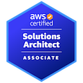

# Hi, I'm Mohanakrishnan! 👋 🖥️ 😎
<!--   -->

## 🏆 Certification
Click on the Badges to verify...!

  
  
  
   

## 🚀 About Me 
I possess a strong thirst for knowledge and am always seeking opportunities to learn.

I am flexible and adaptable, always ready to learn and take on new responsibilities.

  
  <!-- 
   -->
  
  
  
  
  
  
  
  
  

## 🛠 Skills
|||
|-|-|
| **AWS Services** | IAM, EC2, S3,VPC, Route53, SNS, SQS, Lambda, AWS Backups, EFS, RDS, Secrets Manager, Amazon OpenSearch Service, CloudFront, CloudWatch|
| **Version Control System**| Git, GitHub, GitLab|
| **Configuration Management**| Ansible |
| **Containerization Tools**| Docker, Kubernetes |
| **Infrastructure as code (IaC)**| Packer, Terraform |
| **Monitoring Tools**| Prometheus, Grafana, SonarQube, Sentry |
| **Project Management Tools**| Jira, Confluence |
| **Testing tools**| JMeter, LoadRunner |

